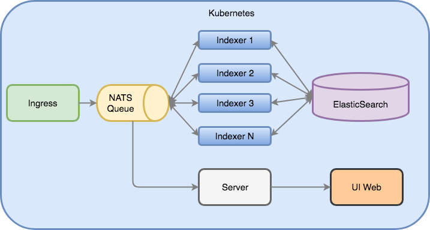

# Description
Kubernetes Auto-Scaling presentation and code samples

### Demo application

Simple pipline to:

* Collect all Flight Crashes from CSV file
* Find GPS coordinates in Google Maps API
* Index Flight Crashes in ElasticSearch
* Show all Flight Crashes in Real Time on the map

#### Architecture



#### Problem

Google API is pretty slow

#### Solution

Scale `Indexer` which is responsible for fetching GPS coordinates

### Deploy Demo Application

Start minikube:
```
$ minikube start
```

Install Elasticsearch:
``` 
$ kubectl apply -f kube/es/es-namespace.yaml
$ kubectl apply -f kube/es
```

Install NATS:
```
$ kubectl apply -f kube/nats/nats-operator.yaml
$ kubectl apply -f kube/nats/deployment.yaml
```

Change Google Maps API Key in file `kube/indexer/indexer.dep.yaml`
```
    env:
    - name: GOOGLE_MAPS_API_KEY
        value: "<PUT YOUR API KEY HERE>"
```

Deploy Deployment and Service for Indexer: 
```
$ kubectl apply -f kube/indexer/indexer.dep.yaml
$ kubectl apply -f kube/indexer/indexer.svc.yaml
```

Deploy Deployment and Service for UI: 
```
$ kubectl apply -f kube/ui/ui.dep.yaml
$ kubectl apply -f kube/ui/ui.svc.yaml
```

Deploy Deployment and Service for Server: 
```
$ kubectl apply -f kube/server/server.dep.yaml
$ kubectl apply -f kube/server/server.svc.yaml
```

To start flight crashes inflow:
```
$ kubectl apply -f kube/ingress/ingress.job.yaml
```

Open browser:
[http://192.168.99.100:32222](http://192.168.99.100:32222)

Flight Crash Locations should appears on the map.

### Scaling Demo Application - CPU/Memory metrics

Install Metrics Server:
```
kubectl apply -f kube/metrics-server
```

Deploy HPA(Horizontal Pod Autoscaler):
```
kubectl apply -f kube/indexer/indexer.hpa.yaml
```

Check whether our `Indexer` is scaled out - it might take 1-2 mins:
```
kubectl get hpa
```

### Scaling Demo Application - Custom metrics

Custom metrics are stored in Prometheus - we need to deploy it first, with proper adapter:
```
$ kubectl create -f kube/monitoring/namespace.yaml
$ kubectl create -f kube/monitoring/prometheus
$ cd kube && make certs
$ kubectl create -f kube/custom-metrics-api
```

Now we need to restart our `Indexer` and `Ingress`:
```
$ kubectl delete -f kube/indexer/indexer.dep.yaml
$ kubectl delete -f kube/indexer/indexer.hpa.yaml
$ kubectl delete -f kube/ingress/ingress.job.yaml

$ kubectl apply -f kube/indexer/indexer.dep.yaml
```

And run new HPA based on custom metrics:
```
$ kubectl apply -f kube/indexer/indexer.hpa.custom2.yaml
```

And start `Ingress` to start again the generating data:
```
$ kubectl apply -f kube/ingress/ingress.job.yaml
```

And we're done! New HPA should scale our `Indexer` based on the custom metric `http_requests_google_api`

Let's check if our deployment has beed scaled up - it might take 1-2 mins:
```
$ watch -n1 kubectl get hpa
```

We could check if metrics are in Prometheus:
[http://192.168.99.100:31190/graph?g0.expr=http_requests_google_api_total](http://192.168.99.100:31190/graph?g0.expr=http_requests_google_api_total)

And if metrics are available for Kubernetes via the adapter:
```
$ kubectl get --raw "/apis/custom.metrics.k8s.io/v1beta1/namespaces/default/pods/*/http_requests_google_api" | jq .
```
